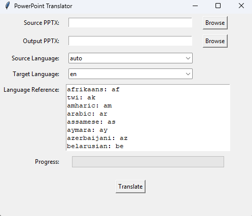

# PowerPoint Translator

A Python application with a graphical user interface (GUI) to translate PowerPoint (.pptx) files from one language to another using the `deep-translator` library with Google Translate as the default engine.

## Features
- Translate text in slides, tables, and charts
- Select source and target languages from a comprehensive list
- Browse for input and output .pptx files
- Progress bar to track translation progress
- Support for auto-detection of source language
- User-friendly GUI built with Tkinter

## Prerequisites
- Python 3.6 or higher
- Required libraries:
  ```bash
  pip install python-pptx
  pip install deep-translator

  #Installation
  
  #Clone the repository:
  git clone https://github.com/zacharylamhk/PowerPointTranslator.git
  cd powerpoint-translator
  
  #Install dependencies:
  pip install -r requirements.txt


  #Run the Program
  python PPTTranslatorApp.py


